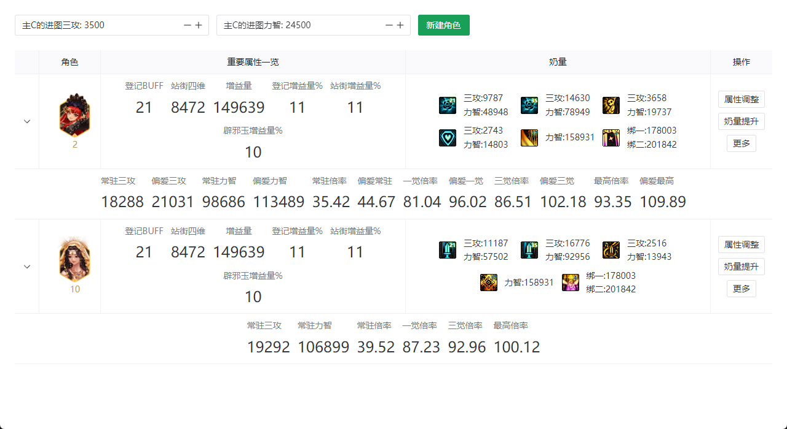
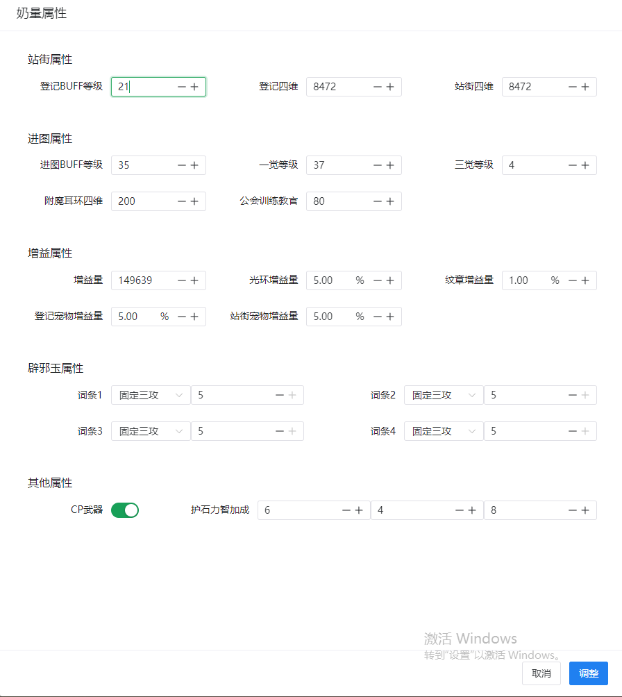
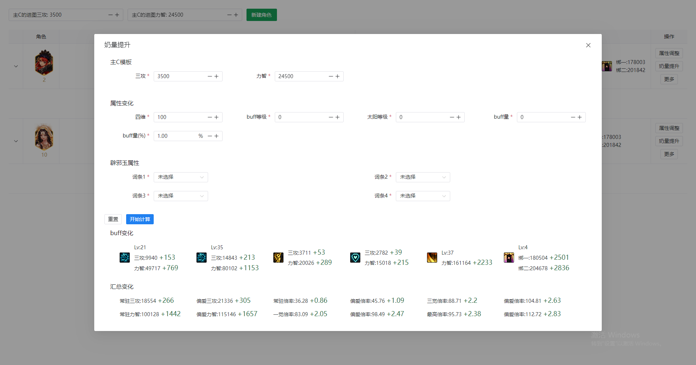

# DNF奶量计算器
为DNF辅助角色奶量计算和奶量提升提供便利的免费工具

## 特色功能一览
### 快速创建角色 
> 支持选择模板和角色类型

### 奶量一图流
> 更加直观的看到辅助角色的奶量数据

### 属性调整
> 创建的模板 都是至高奶量，可根据自己的角色进行调整

### 奶量提升
> 可根据特色提升,直接计算提升率

## 技术框架
- [Vue](https://cn.vuejs.org/)
- [Vite](https://vitejs.cn/vite3-cn/guide/)
- [Tauri](https://tauri.app/zh-cn/)
- [Navui](https://www.naiveui.com/zh-CN/light)

## 致谢
- 感谢 [DNF计算器](https://www.dnftools.com/) 提供的DNF相关数据支持
- 感谢作者 [Vixiu](https://github.com/Vixiu/count_buff) 提供的奶量计算器相关逻辑

